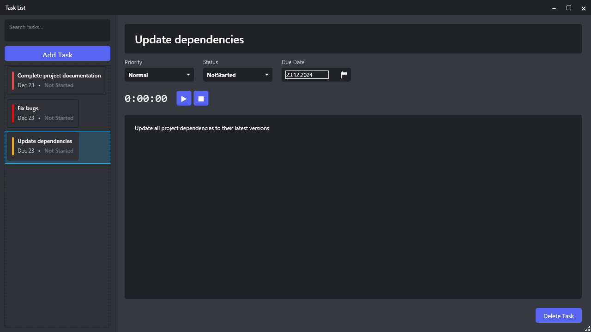

# TaskList 📝

<div align="center">



[](https://dotnet.microsoft.com/download/dotnet/8.0)
[](https://www.microsoft.com/windows)
[](https://www.sqlite.org/index.html)
[](https://visualstudio.microsoft.com/)

</div>

## 🌟 Overview

TaskList is a sophisticated task management application that combines the sleek aesthetics of Discord with powerful productivity features. Built using modern WPF and .NET 8 technologies, it offers a seamless and intuitive experience for managing your daily tasks and projects.

### 🎯 Key Features

<table>
<tr>
<td width="50%">

#### 📊 Task Management
- Priority levels (Normal, High, Urgent)
- Status tracking (Not Started, In Progress, Completed)
- Rich text descriptions
- Due date scheduling
- Detailed task progress monitoring

</td>
<td width="50%">

#### ⚡ Core Functionality
- Real-time task updates
- Built-in time tracking
- Task search and filtering
- Data persistence with SQLite
- Keyboard shortcuts

</td>
</tr>
</table>

### 🎨 User Interface

<table>
<tr>
<td width="50%">

#### 💫 Modern Design
- Discord-inspired dark theme
- Smooth animations
- Custom-styled controls
- Responsive layout
- Intuitive navigation

</td>
<td width="50%">

#### 🛠️ Technical Features
- MVVM architecture
- Custom WPF controls
- Entity Framework Core
- Dependency injection
- Event-driven updates

</td>
</tr>
</table>

## 📦 Installation

### Prerequisites

Make sure you have the following installed:
- Windows 10/11
- [.NET 8 SDK](https://dotnet.microsoft.com/download/dotnet/8.0)
- [Visual Studio 2022](https://visualstudio.microsoft.com/vs/) (recommended) with:
  - .NET Desktop Development workload
  - Windows SDK

### Quick Start

1. Clone the repository:
```bash
git clone https://github.com/FodiYes/TaskListSQL.git
cd TaskListSQL
```

2. Build and run:
```bash
dotnet restore
dotnet build
dotnet run --project TaskList
```

Or simply open `TaskList.sln` in Visual Studio and press F5.

## 💡 Usage Guide

### Task Management

#### Creating Tasks
1. Click the "Add Task" button or press `Ctrl+N`
2. Enter task details:
   - Name (required)
   - Priority level
   - Due date
   - Description

#### Time Tracking
- ▶️ Start timer: Click play button or press `F5`
- ⏹️ Stop timer: Click stop button or press `F6`
- 🔄 Reset timer: Right-click timer and select "Reset"

#### Task Organization
- Drag and drop tasks to reorder
- Use priority colors for visual organization:
  - 🔴 Urgent
  - 🟡 High
  - 🟢 Normal

### Keyboard Shortcuts

| Action | Shortcut |
|--------|----------|
| New Task | `Ctrl+N` |
| Save | `Ctrl+S` |
| Delete Task | `Delete` |
| Start Timer | `F5` |
| Stop Timer | `F6` |
| Search | `Ctrl+F` |

## 🛠️ Technical Details

### Architecture

The application follows the MVVM pattern with these key components:

```
TaskList/
├── Models/             # Data models and database entities
├── ViewModels/         # MVVM view models with business logic
├── Views/              # WPF views and user controls
├── Services/           # Business logic and data services
├── Converters/         # WPF value converters
└── Helpers/            # Utility classes and extensions
```

### Dependencies

- **UI Framework**
  - WPF (Windows Presentation Foundation)
  - CommunityToolkit.Mvvm

- **Data Access**
  - Microsoft.EntityFrameworkCore.Sqlite
  - Microsoft.EntityFrameworkCore.Tools

- **Dependency Injection**
  - Microsoft.Extensions.DependencyInjection

## 🤝 Contributing

We welcome contributions! Here's how you can help:

1. 🍴 Fork the repository
2. 🌿 Create a feature branch (`git checkout -b feature/AmazingFeature`)
3. 💾 Commit your changes (`git commit -m 'Add some AmazingFeature'`)
4. 📤 Push to the branch (`git push origin feature/AmazingFeature`)
5. 🔄 Open a Pull Request

## 📄 License

This project is licensed under the MIT License - see the [LICENSE](LICENSE) file for details.

## 🙏 Acknowledgments

- Inspired by Discord's modern UI/UX design
- Built with .NET 8 and WPF
- Uses Entity Framework Core for data persistence
- Community feedback and contributions

---

<div align="center">

Made with ❤️ by [DAN](https://github.com/FodiYes)

</div>
